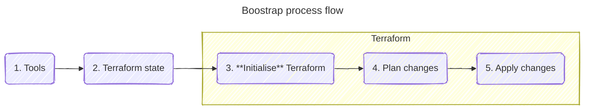
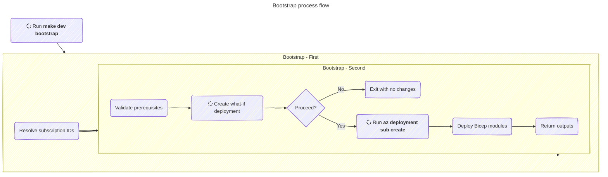

# Infrastructure Guide

## What this contains

The infrastructure folder contains the IaC definitions and environment configuration used to bootstrap Azure prerequisites and then run Terraform safely.

## General IaC process flow

At a high level, the delivery flow is:



| Step | Description |
| --- | --- |
| 1. Setup local environment | Ensure required tools are installed and authenticated (make, bash, Azure CLI, Terraform, git). |
| 2. Setup Terraform state | Create state backend resources (storage and private connectivity) before standard Terraform operations. |
| 3. Initialise Terraform | Run `terraform init` to configure backend and download providers and modules. |
| 4. Generate a resource plan | Run `terraform plan` to see the proposed delta between current and desired state. |
| 5. Apply the resource plan | Run `terraform apply` to execute approved changes. |

Terraform requires remote state backend resources. In this repository, bootstrap creates those resources first so later Terraform commands can run consistently.

## Using `make`

The repository uses make targets to provide a single, repeatable command interface for developers and pipelines.

The main make file depends on other make files to create relevant targets:

- [Main make file](../Makefile) - the main entry file
- [Environment targets](../scripts/make/environment.mk) - targets for setting up environment variables per deployment environment
- [Azure targets](../scripts/make/azure.mk) - targets for Azure cloud commands
- [Bootstrap targets](../scripts/make/bootstrap.mk) - targets to establish initial Terraform resources
- [Terraform targets](../scripts/make/terraform.mk) - targets for all Terraform commands
- [Bootstrap orchestrator](../scripts/bootstrap/run_bootstrap.sh) - script to orchestrate the bootstrap process

## The bootstrap process

We use a bootstrap process to provision minimum Azure foundation required for Terraform state management. This process typically only needs to be run once per environment, however if you tear down all resources in the target environment and start afresh, bootstrap ensures Terraform state resources are available.

> This process is necessary before running any of the Terraform-related make targets

The following diagram shows an overview of what the bootstrap process does:



| Process | What it does |
| --- | --- |
| Run `make dev bootstrap` | Starts bootstrap process using the `dev` environment context and environment variables. |
| Set Azure account | Selects the target subscription for all Azure CLI context. |
| Resolve subscription IDs | Resolves HUB_SUBSCRIPTION_ID and ARM_SUBSCRIPTION_ID used by deployment steps. |
| Run bootstrap orchestrator script | Executes the Bash script that performs validation, what-if, and deployment. |
| Validate prerequisites | Confirms required Entra group and hub subscription metadata are available. |
| Create what-if deployment | Shows previewed subscription-scope changes before any live update. |
| Exit with no changes | Stops execution safely without infrastructure changes. |
| Run az deployment sub create | Executes the subscription-scoped Bicep deployment. |
| Deploy bootstrap Bicep modules | Creates and wires storage, private DNS, private endpoint, and infra resource group resources. |
| Return bootstrap outputs | Provides IDs for verification and downstream automation. |

## Bootstrap prerequisites

Before running bootstrap, several tools and other requirements must be in place:

- Install Azure CLI and authenticate with `az login`.
- Ensure access to both subscriptions specified in the target environment's variables script.
- Ensure the required Entra group exists: `screening_<app-short-name>_<environment>`.
- Install GNU Make and Bash.
- On Windows with WSL, you might run into CRLF issues so please ensure the shell and make files use LF endings.

## Bootstrap inputs

Many bootstrap inputs have default values which are defined in separate environment files. The environment make file loads the environment variables per environment target specified (`dev`, `prod`)

Environment target definitions:

- [scripts/make/environment.mk](../scripts/make/environment.mk)

Environment-specific variables:

- [infrastructure/environments/dev/variables.sh](environments/dev/variables.sh)
- [infrastructure/environments/prod/variables.sh](environments/prod/variables.sh)

Common variables:

| Variable | Purpose |
| --- | --- |
| REGION | Azure region for deployment. Default is UK South. |
| APP_SHORT_NAME | Application short code to identify the deployments and resources. Default is 'nbsse'. |
| STORAGE_ACCOUNT_RG | Resource group that hosts Terraform state storage. Default is 'rg-dtos-state-files'. |
| ENABLE_SOFT_DELETE | Enables or disables blob delete retention policies. |
| AZURE_SUBSCRIPTION | Full display name of the application subscription used for 'az account set'. |
| HUB_SUBSCRIPTION | Full display name of the hub subscription used to resolve hub subscription ID. |

## Bicep modules

Bicep is used because it's native to Azure Resource Manager, supports subscription-scope deployments, and allows us to easily compose focused modules. For establishing initial Terraform resources, this means we establish predictable orchestration with clear parameters, outputs, and preflight checks via what-if scenarios.

Each Bicep module covers a single concern, and the top-level `main.bicep` coordinates its dependencies via explicit module outputs rather than implied assumptions.

The Bicep bootstrap modules are found in [infrastructure/bootstrap](bootstrap).

| Bicep file | Creates or configures | Outputs |
| --- | --- | --- |
| [main.bicep](bootstrap/main.bicep) |  | storageAccountId, storagePrivateDNSZoneId, storagePrivateEndpointId, infraResourceGroupId |
| [terraformStorage.bicep](bootstrap/terraformStorage.bicep) | Terraform state backend resources | Storage account, blob service, Terraform state container, role assignment for Entra group | userGroupPrincipalID and target resource group scope | storageAccountID |
| [dns.bicep](bootstrap/dns.bicep) | Private DNS zone lookup | | privateDNSZoneID |
| [privateEndpoint.bicep](bootstrap/privateEndpoint.bicep) | Private endpoint wiring | | Existing hub VNet and subnet, resourceID, privateDNSZoneID | privateEndpointID |

### Bicep deployment parameters

The bootstrap template [infrastructure/bootstrap/main.bicep](bootstrap/main.bicep) accepts:

- `enableSoftDelete`
- `envConfig`
- `region`
- `storageAccountRGName`
- `storageAccountName`
- `appShortName`
- `userGroupPrincipalID`

## Outputs from bootstrap

Human-readable output from script execution includes:

- Resolved hub subscription name and ID.
- Resolved Entra group display name and principal ID.
- What-if preview.
- Final deployment output from Azure CLI.

Bicep deployment outputs include:

- storageAccountId
- storagePrivateDNSZoneId
- storagePrivateEndpointId
- infraResourceGroupId

## How to run bootstrap

From the repository root containing the main make file, inside a bash terminal enter:

```bash
make dev bootstrap
```

You can also specify any optional overrides as environment variables passed to the script, like:

```bash
make dev bootstrap REGION="UK South" APP_SHORT_NAME="nbsse"
```

To target a production environment, please use the following:

```bash
make prod bootstrap
```

> Note: production environment values currently include placeholders in [infrastructure/environments/prod/variables.sh](environments/prod/variables.sh), so update those first.

## Common next commands

After bootstrap succeeds, typical Terraform workflow is:

```bash
make dev terraform-init
make dev terraform-plan
make dev terraform-apply
```

---

## Troubleshooting

**WSL error: `env: bash\r not found`**
  Cause: shell files are saved with CRLF.
  Fix:

- Convert to LF endings.
- Keep .gitattributes enforcing LF for shell scripts.

**set: `invalid option pipefail`**
  Cause: usually CRLF line ending symptom.
  Fix:

- Convert affected shell files to LF.

**Unable to resolve hub subscription**
  Cause: HUB_SUBSCRIPTION value does not match a known subscription display name.
  Fix:

- Verify values in environment variable files.
- Validate account access with Azure CLI.

**Required Entra group not found**
  Cause: missing group or permission issue when querying Entra.
  Fix:

- Verify naming pattern `screening_<app-short-name>_<environment>`.
- Confirm your account can query Entra groups.
  - use `az login --tenant xxxx` to log into the specified tenant

**Failed to clone `dtos-devops-templates` during `terraform-init`**
  Cause: network access to GitHub blocked, or invalid TERRAFORM_MODULES_REF.
  Fix:

- Check connectivity and credentials to GitHub.com.
- Verify TERRAFORM_MODULES_REF in environment variables.
